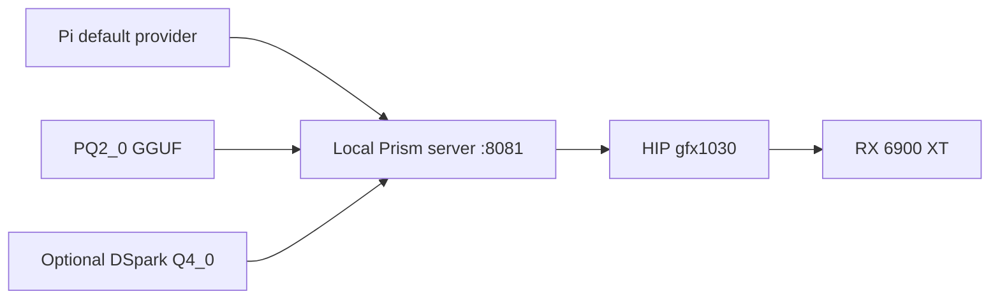
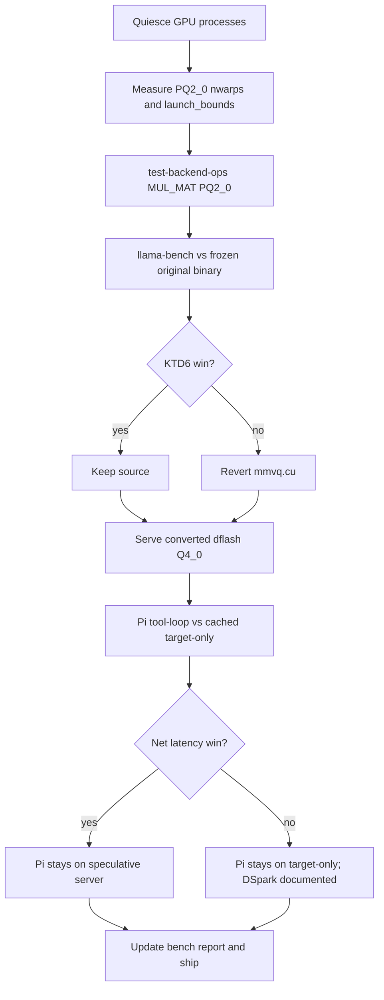

# Bonsai RX 6900 XT Inference - Plan

## Goal Capsule

Make Bonsai 27B the default local Pi coding model on the RX 6900 XT, with measured HIP performance and a keep-or-drop record for every hardware experiment.
Means: PrismML-Eng/llama.cpp on HIP gfx1030, localhost OpenAI-compatible serving, DSpark only if it beats the cached target-only path (KTD1, KTD5).
The executing agent owns setup, measurement, integration, and verification. Preserve the existing Qwen Pi provider and the read-only `D:\llama.cpp` checkout. Stop only for a demonstrated blocker or user interruption.

---
## Product Contract

Product Contract unchanged.

### Summary

Install the specified ternary Bonsai model, configure local serving and Pi, record untuned inference performance, and keep only measured hardware improvements. Evaluate the published trained drafter as the model's available multi-token acceleration path.

### Problem Frame

The user has an AMD 16 GB GPU and a previously tuned llama.cpp checkout, but needs a verified Bonsai installation and hardware-specific evidence on this card.

### Key Decisions

- Use PrismML-Eng/llama.cpp, not upstream llama.cpp and not the reference checkout as the runtime. (session-settled: user-directed — chosen over upstream or D:\llama.cpp runtime: the published PQ2_0 kernels live in this fork.) Governs R1.
- Make the verified Bonsai endpoint Pi's default without replacing the existing Qwen provider. (session-settled: user-directed — chosen over swapping the 8080 Qwen provider: preserve the working local stack.) Governs R2.
- Measure an untouched baseline with llama-bench and Pi `-p` before any keep decision. (session-settled: user-directed — chosen over tuning first: prior gfx1030 work retracted false wins from competing VRAM.) Governs R3, R4, R5.
- Treat DSpark/dflash as the trained acceleration path; do not invent native MTP. (session-settled: user-directed — chosen over adding a next-n head: the GGUF has no MTP tensors.) Governs R6.

### Requirements

**Installation and agent use**

- R1. Use PrismML-Eng/llama.cpp for prism-ml/Ternary-Bonsai-27B-gguf on RX 6900 XT.
- R2. Make the verified Bonsai endpoint Pi's default, preserving existing providers and backing up settings.

**Measurement and optimization**

- R3. Record an untuned baseline using both llama-bench and actual Pi `-p` before performance modifications.
- R4. Inspect the user's reference llama.cpp checkout and evaluate applicable optimizations after the baseline.
- R5. Retain tuning only with correctness evidence and repeatable improvement; report unsuccessful experiments.
- R6. Assess MTP feasibility and test the available trained speculative drafter when supported, separating DSpark from native MTP.

### Success Criteria

- Pi with no model flags uses `bonsai-local/bonsai-27b` and passes the short-reply and read-tool smokes.
- Untouched and final llama-bench pp512/tg128 plus Pi `-p` numbers are saved with revision, flags, and device.
- Every source or runtime experiment has a keep, drop, or inconclusive record against KTD6.
- Native MTP is recorded as infeasible from these weights; DSpark is measured and left opt-in unless it wins on both decode and Pi tool-loop latency.

### Scope Boundaries

In scope: local text inference, Pi tool use, HIP gfx1030 build and runtime tuning, bounded mmvq changes, DSpark/dflash serving, and a personal-fork PR of retained source and docs.

Deferred to follow-up: vision mmproj, 4-bit KV as a default, native ternary packing, hidden-state H2D overlap for DSpark.

Outside this work: training an MTP head, editing the read-only reference checkout, replacing the Qwen `:8080` provider, claiming global optimality.

---
## Planning Contract

### Key Technical Decisions

- KTD1. Pin Prism `prism` at `9a9394a895b96003ca842a6041cb28ac49a108f7`. README supports PQ2_0 on HIP; use HIP/gfx1030 first. Vulkan plus the published g64 pack is the same-fork fallback only if HIP cannot run correctly. (session-settled: user-directed — chosen over upstream llama.cpp: PQ2_0 kernels are fork-specific.)
- KTD2. Keep model files, logs, and build outputs outside tracked source. Use localhost port 8081 and `HIP_VISIBLE_DEVICES=1` then `--device ROCm0` so the iGPU never receives gfx1030 kernels and the Qwen service on 8080 is not replaced.
- KTD3. Serve with 32768 context and one slot for the target-only path. Lower context only if measured memory requires it. Register Pi context and output limits to match the server. Use a dedicated `bonsai-local` provider.
- KTD4. Establish a clean source baseline before optimization. Use repeated pp512/tg128 runs and fixed Pi prompts. Record build revision, flags, device, token counts, wall time, and server timings. Compare generation and prefill separately. Kill every other llama/HIP process first; a second resident model invalidates the run.
- KTD5. DSpark/dflash is the available trained acceleration mechanism, not `draft-mtp`. Follow Prism conversion (`gguf-py/gguf/scripts/gguf_dspark_to_dflash.py --drop-shared-tensors`) and `--spec-draft-n-max 4`. Require matching tokenizer, nonzero `draft_n` / `draft_n_accepted`, and measured net benefit on both decode tok/s and ordinary-profile Pi read-tool wall time at the same context as the cached target-only server. Short-prompt wall time and smoke pass/fail are not substitutes for that Pi half. Target-only remains the Pi default unless that bar is met. DSpark may become the Pi default only at that same context (32768 unless already lowered for memory). If the Q4_0 sidecar cannot fit it, leave DSpark documented opt-in. (session-settled: user-directed — chosen over implementing native MTP: the PQ2_0 GGUF has no nextn tensors.)
- KTD6. Remaining source work is the PQ2_0 RDNA2 nwarps=8 A/B plus optional `__launch_bounds__(…, 2)`. The t/ub runtime grid is already measured (t=4/8, ub=256/1024) with no ≥5% win and must not be rerun unless that grid was contaminated; keep serving at t=8, ub=512 until a KTD6 win exists. Retain a kernel when interleaved A/B shows a paired tg128 improvement of at least 5% with no ordinary-profile Pi read-tool regression. Prefill is informational. Effects under 5% are inconclusive on this desktop. Report unsuccessful experiments and revert abandoned source.

### High-Level Technical Design

### Assumptions and Risks

Windows HIP is already proven by a loaded PQ2_0 server on this card; remaining work is keep/reject, not first-boot. Competing VRAM (second llama process, Radeon Instant Replay) has already invalidated one sweep and must be treated as a hard stop. Same flags on this desktop have moved ~37% across sessions, so pair and interleave before ranking. DSpark disables cross-request prompt cache, so a decode tok/s win can still lose Pi tool-loop time. BF16 drafter cannot co-reside on 16 GB; only the converted Q4_0 sidecar is a serving candidate. Origin is PrismML-Eng/llama.cpp with a shallow `prism` clone; ship through a personal fork. Machine-local SDK, weights, Pi settings, and results stay out of git.

---
## Implementation Units

### U1. Build and validate Bonsai on the target GPU

**Goal:** HIP gfx1030 binaries load the hashed PQ2_0 file on the RX 6900 XT and answer a short chat on port 8081.
**Requirements:** R1. **Dependencies:** none.
**Files:** `scripts/bonsai/build-hip.cmd`, `scripts/bonsai/runtime.py`, `scripts/bonsai/start-server.py`; patterns in `ggml/src/ggml-hip/CMakeLists.txt` and `docs/build.md`.
**Approach:** Reuse the existing TheRock SDK, `GPU_TARGETS=gfx1030` Ninja/clang build, and dedicated server script. Verify model hash and device logs rather than re-downloading when `results/model-integrity.json` already matches. Preserve an existing `build-hip-original` tree whose HIP DLL matches `7920de6a4b6f843da72f9f258c8e8e58aa006a99874fb267f796fb17e37bb6fc`. Do not snapshot the nwarps=8 working-tree build as that original.
**Execution note:** This is install and runtime smoke, not new unit tests. Do not rebuild over `build-hip-original`.
**Test scenarios:**
- Device listing after `HIP_VISIBLE_DEVICES=1` identifies RX 6900 XT as ROCm0.
- Model loads with `-ngl 999` and returns a deterministic short chat.
- A busy port 8081 is refused rather than reused.
**Verification:** Build logs, model hash/size, device allocation, and a successful `/v1/chat/completions` response are saved.

### U2. Integrate Pi and capture untouched baselines

**Goal:** Pi defaults to Bonsai, and untuned llama-bench plus Pi `-p` numbers exist before any keep decision.
**Requirements:** R2, R3. **Dependencies:** U1.
**Files:** `scripts/bonsai/configure-pi.py`, `scripts/bonsai/benchmark.py`, `scripts/bonsai/benchmark-pi.py`, `scripts/bonsai/benchmark-api.py`, `docs/benchmarks/bonsai-rdna2.md`.
**Approach:** Merge a dedicated `bonsai-local` provider; do not rewrite the existing `llama.cpp` Qwen provider. Capture or reuse untouched llama-bench pp512/tg128 and Pi `-p` baselines from the hashed `build-hip-original` binary, not from the nwarps=8 server. If those artifacts already exist and name HIP DLL `7920de6a4b6f843da72f9f258c8e8e58aa006a99874fb267f796fb17e37bb6fc`, do not recapture; write them into the bench report if the report still omits them.
**Execution note:** Do not re-run `configure-pi.py --apply` unless the endpoint, model id, or default launch context changed.
**Test scenarios:**
- New Pi invocation with no model flags selects `bonsai-local/bonsai-27b`.
- Short prompt replies `BONSAI_OK`.
- Read-tool prompt returns the probe file contents exactly.
- Existing Qwen provider entries remain in `models.json`.
**Verification:** Raw JSON/logs include provider, model id, token counts, and wall time. Ordinary and controlled Pi profiles are stored separately.

### U3. Tune and compare hardware-specific changes

**Goal:** Keep or drop the PQ2_0 RDNA2 mmvq nwarps=8 override, and optionally `__launch_bounds__(…, 2)`, from interleaved A/B on a quiet GPU.
**Requirements:** R4, R5. **Dependencies:** U2.
**Files:** `ggml/src/ggml-cuda/mmvq.cu`, `tests/test-backend-ops.cpp`, `scripts/bonsai/benchmark.py`, `docs/benchmarks/bonsai-rdna2.md`.
**Approach:**
1. Quiesce competing HIP/llama processes and Radeon Instant Replay before any GPU run.
2. Interleave A/B of `build-hip-original` versus the patched binary on a quiet GPU. Compare the working-tree PQ2_0 `nwarps=8` override against that hashed original, not against Q4_K H-R9 numbers. The reference whitelist omits PQ2_0; do not copy it. Keep only if paired tg128 improves ≥5% with no ordinary-profile Pi read-tool regression. Treat pp512 as informational.
3. Optionally A/B RDNA2 `__launch_bounds__(…, 2)` on `mul_mat_vec_q` (reference win was ~0.1% on Q4_K; treat as likely inconclusive here).
4. Do not retry FORCE_CUBLAS, FORCE_MMQ, graphs-off, MFMA-off, unsafe-math, nwarps=16, or FA-off.
5. Runtime t/ub grid already measured clean at t=4/8 and ub=256/1024 with no ≥5% win; do not rerun unless the GPU was not quiet. Keep serving at t=8, ub=512 until a KTD6 win exists.
6. Revert abandoned mmvq source before the final diff.
**Execution note:** Run `test-backend-ops` for MUL_MAT / PQ2_0 against CPU before treating a kernel as a candidate. Preserve the original HIP DLL hash `7920de6a4b6f843da72f9f258c8e8e58aa006a99874fb267f796fb17e37bb6fc` as the baseline binary.
**Patterns to follow:** Existing `calc_nwarps` / `MMVQ_PARAMETERS_RDNA2` in `mmvq.cu`; extra PQ2_0 `test_mul_mat` shapes already added in `tests/test-backend-ops.cpp`; HIP warp size via `ggml_cuda_get_physical_warp_size()`.
**Test scenarios:**
- PQ2_0 MUL_MAT cases at K in {5120, 8192, 8320, 17408} match CPU within backend-ops tolerance.
- Interleaved three-rep llama-bench pp512/tg128 vs `build-hip-original`; keep only if paired tg128 improves ≥5% with no ordinary-profile Pi read-tool regression.
- Unchanged short chat remains coherent after a kept kernel.
- A contaminated run (second model still resident) is discarded, not ranked.
**Verification:** Every experiment has command, revision, DLL hash, mean/spread, and keep/drop/inconclusive. Non-winning source is absent from the final diff.

### U4. Evaluate trained multi-token acceleration and finalize

**Goal:** Measure converted DSpark/dflash on this card, leave Pi on the winning launch, and write the durable report.
**Requirements:** R6, R2, R5. **Dependencies:** U3.
**Files:** `scripts/bonsai/start-server.py`, `common/speculative.cpp`, `gguf-py/gguf/scripts/gguf_dspark_to_dflash.py`, `docs/benchmarks/bonsai-rdna2.md`.
**Approach:**
1. Do not implement native MTP. `qwen35` MTP graph requires `n_layer_nextn == 1` and `nextn.eh_proj` / `enorm` / `hnorm`; this GGUF has none.
2. Do not reconvert. Use `Ternary-Bonsai-27B-dspark-dflash-Q4_0.gguf` (arch `dflash`, block size 4, shared tensors dropped). Hash it into results.
3. Start speculative serving with `--spec-type draft-dspark --spec-draft-n-max 4 -ngld 999` at `-c 16384` first as a load smoke, then at 32768 if VRAM allows. Never set n-max below 4.
4. Confirm `timings.draft_n` and `draft_n_accepted` are nonzero on a code prompt.
5. Compare decode tok/s and ordinary-profile Pi read-tool wall time from `benchmark-pi.py` against the cached target-only 32768 server at the same context. Enable as Pi default only if both improve under KTD5 and the speculative server is that same context. If Q4_0 cannot fit 32768, leave DSpark documented opt-in. If the default launch context changes, re-run `configure-pi.py --apply`.
6. Update `docs/benchmarks/bonsai-rdna2.md` with baseline, sweep, kernel keep/drop, DSpark, launch, and rollback. Commit scripts, docs, and retained kernel only.
**Execution note:** Smoke-first: target-only must still work before attaching `-md`. Build `llama-speculative-simple` if server draft flags fail to engage.
**Test scenarios:**
- Target-only still serves on 8081 after speculative experiments.
- Drafter loads without tokenizer mismatch.
- API timings include nonzero `draft_n` / `draft_n_accepted`.
- Repeated Pi short and read-tool smokes still pass if speculative is made default; the keep bar uses ordinary-profile read-tool wall time, not smoke pass/fail.
- Native MTP infeasibility is stated in the bench report with the missing-tensor reason.
**Verification:** Best verified configuration is launchable. Pi points at it. Rollback copies under Pi `agent/backups/` remain. Weights, private settings, and private logs are not committed.

---
## Verification Contract

Use this fork's `llama-bench`, `llama-server`, and `test-backend-ops` (filter MUL_MAT / PQ2_0, compare HIP vs CPU). Use installed `pi -p` for application integration. Preserve raw results with commands and configuration. Report repeated mean and spread. Never infer Pi speedup from a kernel-only result. Run GPU experiments serially on a quiet card. Endpoint failure must not leave Pi claiming a working default.

---
## Definition of Done

The model runs on the RX 6900 XT through Prism's fork. Pi defaults to it and passes text/tool smokes. Untouched and final benchmarks are saved. Hardware tuning has been attempted and assessed, including the PQ2_0 nwarps experiment. MTP/DSpark has an evidence-backed result: native MTP infeasible; DSpark measured and either default or documented opt-in. Launch and rollback instructions exist. Abandoned source experiments are removed from the final diff. Commit only this task's source and documentation.

---
## Sources

- https://huggingface.co/prism-ml/Ternary-Bonsai-27B-gguf
- https://github.com/PrismML-Eng/llama.cpp
- https://github.com/PrismML-Eng/Bonsai-demo/blob/main/SPECULATIVE.md
- Fork `README.md`, `ggml/src/ggml-hip/CMakeLists.txt`, `ggml/src/ggml-cuda/mmvq.cu`, `common/speculative.cpp`, `docs/build.md`, `docs/speculative.md`
- Installed Pi `docs/models.md` and local `agent/models.json` / `agent/settings.json`
- User-named reference checkout, inspected independently without edits
